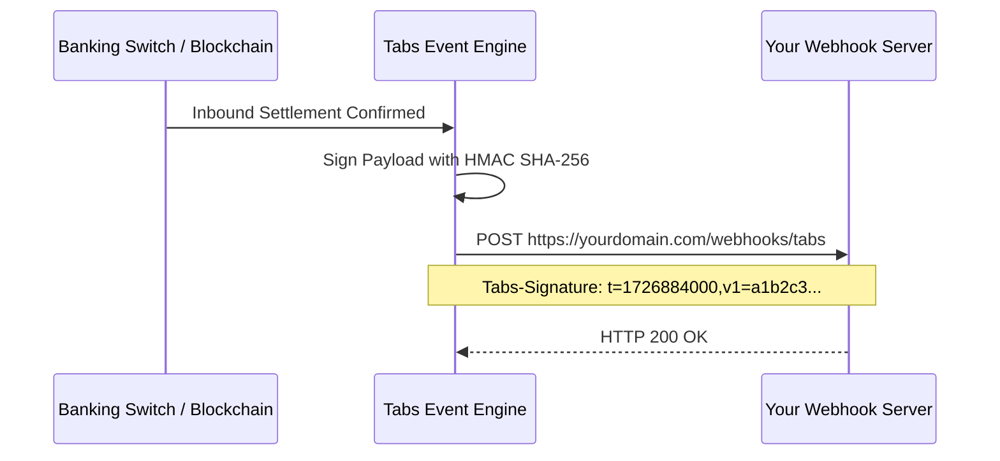

Webhooks allow your application to react automatically to money movement events, such as when a customer deposits funds or when an outgoing bank transfer completes.

Instead of polling the API repeatedly, Tabs sends an HTTP `POST` request with a JSON payload directly to your webhook URL.

---

## Configuring endpoints

You configure webhook endpoints in the [Tabs Merchant Portal](https://app.tabsglobal.co):

1. Navigate to **Developers > Webhooks**.
2. Click **Add Endpoint**.
3. Provide your server's public HTTPS URL (e.g. `https://api.yourdomain.com/v1/webhooks/tabs`).
4. Select the environment:
   - **Live**: Dispatches events triggered by live transactions.
   - **Test**: Dispatches events from sandbox activities and test pings.
5. Subscribe to specific event topics (e.g. `payout.completed`, `deposit.credited`) or select wildcard (`*`) to receive all platform events.
6. Click **Save Endpoint**.

---

## Endpoint signing secret

Each endpoint is assigned a unique signing secret prefixed with `whsec_` (e.g. `whsec_3a8b2f9c4d1e...`).

Use this secret to cryptographically verify that incoming webhooks originated from Tabs and were not altered in transit. See the [Signature verification guide](/webhooks/signatures) for code examples.

---

## Testing with instant ping

To verify your webhook listener is reachable and parsing requests properly:

1. Locate your endpoint in the **Developers > Webhooks** dashboard list.
2. Click **Send Test Ping**.
3. Tabs immediately dispatches an `endpoint.ping` event to your URL and displays the HTTP response status code, latency, and response body directly in the dashboard.
